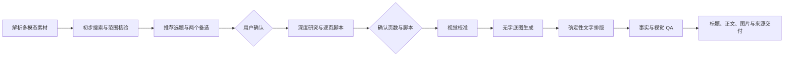
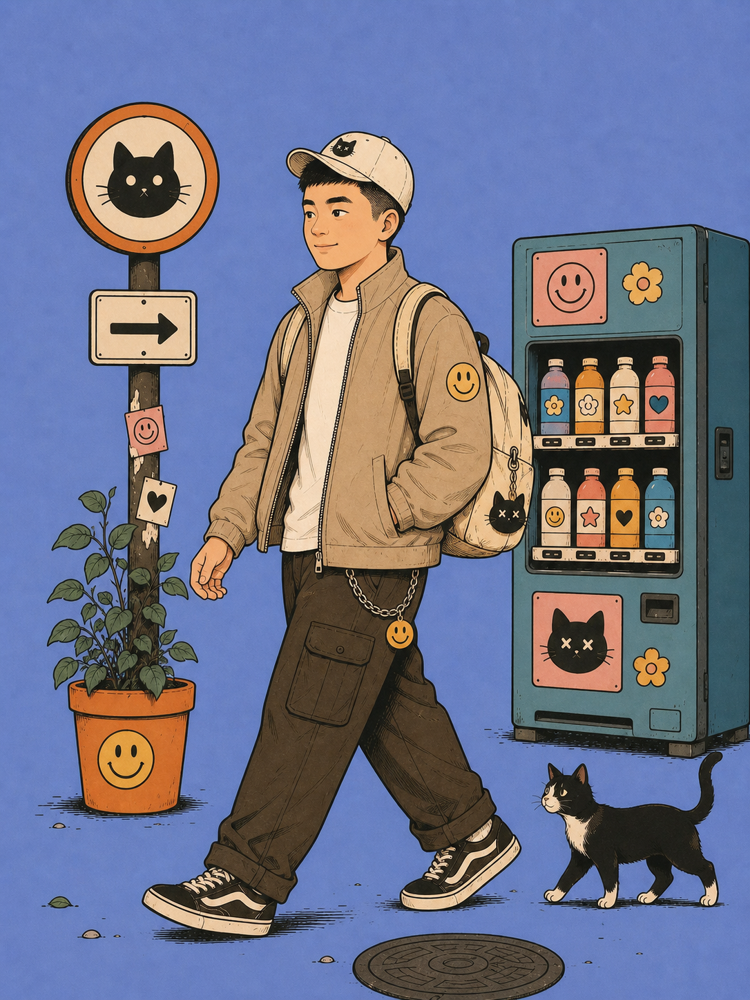
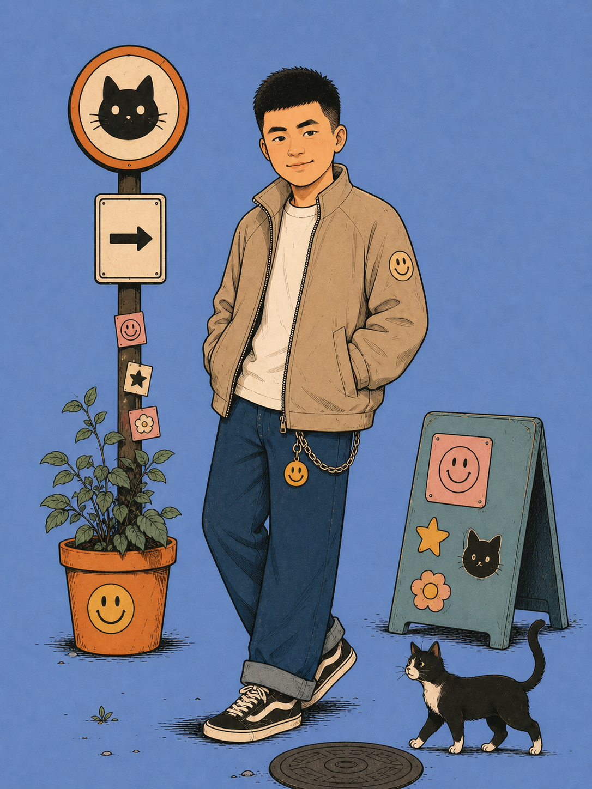
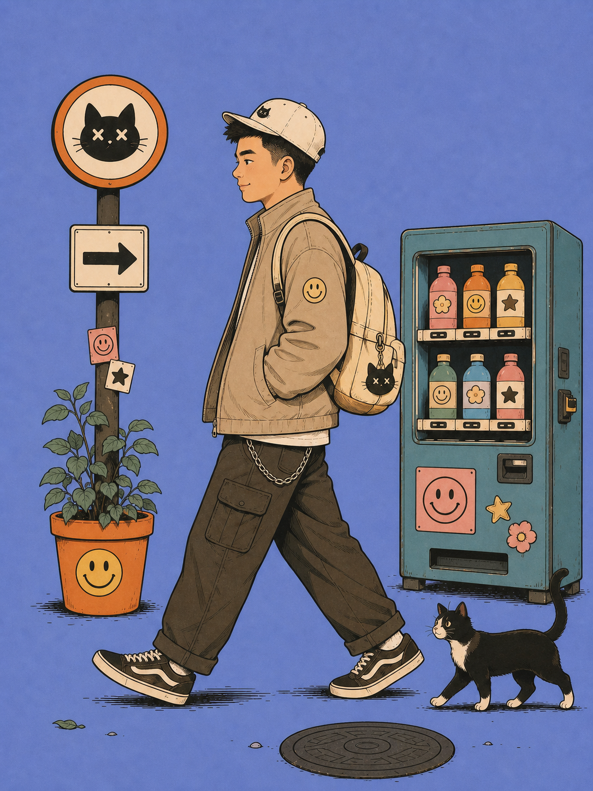

# sfumatoAI Writing Skill

[](LICENSE)
[](ASSET_LICENSE.md)
[](https://github.com/sunshine-lang/sfumatoAI-writing-skill/actions/workflows/validate.yml)

一个面向 AI 小白的小红书知识图文 Skill：把关键词、长文、网页、文件、截图或混合素材，转化为经过资料核验的选题、逐页脚本、统一视觉、多张 3:4 图片和可直接发布的文案。

它的重点不是“把用户投喂的内容压缩成卡片”，而是先判断：**这批素材最值得讲什么？**

> 仓库名保留品牌写法 `sfumatoAI-writing-skill`；Codex Skill 的内部标识遵循小写规范，使用 `sfumatoai-writing-skill`。

## 核心能力

- 接收关键词、文章、URL、PDF、文件、截图及多模态组合输入；
- 先分析选题价值，不盲目摘要；
- 在提出技术选题前搜索并交叉验证可靠来源；
- 识别一词多义、营销话术、事实风险和常见误解；
- 提供 1 个推荐选题与 2 个备选方向；
- 规划至少 4 张、默认 5–7 张的故事化图文；
- 先确认选题、页数、脚本和视觉，再生成正式图片；
- 分离无字底图与确定性中文排版；
- 交付 1 个推荐标题、2 个备选标题、200 字内正文、来源与 QA 结果；
- 自动检查图片数量、3:4 比例、正文长度、标题数量和来源数量。

## 工作流



Skill 会在关键关卡等待确认，不会拿到素材后直接制图，也不会未经授权自动发布内容。

## 安装

### 1. 克隆仓库

```bash
git clone https://github.com/sunshine-lang/sfumatoAI-writing-skill.git
cd sfumatoAI-writing-skill
```

### 2. 安装到 Codex Skills

把 `skills/sfumatoai-writing-skill` 整个目录复制到你的 Codex Skills 目录：

```text
~/.codex/skills/sfumatoai-writing-skill/
```

如果目标目录已存在，请先备份现有版本，再执行替换。

## 使用

在 Codex 中显式调用：

```text
使用 $sfumatoai-writing-skill 分析我提供的素材，先搜索核验并提出选题和页数方案，确认后制作小红书知识图文。
```

也可以直接提供输入：

```text
RAG。我想给对 AI 感兴趣的小白做一组小红书知识图解。
```

```text
请分析这篇文章和两张截图，告诉我最值得做成小红书图文的知识点。不要直接开始制图。
```

## 交付标准

每次完整交付应包含：

1. 1 个推荐标题与 2 个备选标题；
2. 200 字以内正文；
3. 至少 4 张严格 3:4 的图片，首张为封面；
4. 逐页内容脚本；
5. 研究底稿与直接来源链接；
6. 图像生成提示词或可复现规格；
7. 自动检查和人工 QA 结论；
8. 已知限制与未采用版本说明。

## 默认视觉方向

仓库的默认画风以文字化视觉规范为主，并附带作者本人品牌 IP 预览；不包含第三方参考图：

- 长春花蓝纯色背景；
- 轻微纸张颗粒；
- 复古编辑漫画与手绘故事感；
- 中等偏粗的炭黑轮廓；
- 低饱和青绿、橙、奶油和淡珊瑚配色；
- 封面大标题居中，主体词加粗放大；
- 内页文字只放顶部、底部或真实对白气泡；
- 不使用四角角标和标题文字底板。

用户提供新的风格参考时，Skill 会先进行 A/B 校准，不会复制参考图中的账号、原文或专属版式。

## 可选品牌人物 IP

仓库收录三张作者本人品牌人物图，用来展示同一人物在正面、行走和侧面状态下的统一方式。它们不是所有使用者都能自动套用的通用素材；第三方运行 Skill 时应提供自己的原创或已授权人物参考。

<p align="center">
  
  
  
</p>

三张图均为 `1086×1448`、严格 3:4 的 AI 辅助重绘。原始参考图及其中的第三方平台标识没有进入本仓库。图片的肖像、品牌和素材权利不属于 MIT License，具体边界见 [ASSET_LICENSE.md](ASSET_LICENSE.md)。

## 自动验证

检查仓库结构：

```bash
python3 scripts/check_repository.py
```

检查一组图文交付：

```bash
python3 skills/sfumatoai-writing-skill/scripts/validate_delivery.py /absolute/path/to/manifest.json
```

交付清单模板位于：

```text
skills/sfumatoai-writing-skill/assets/delivery-manifest.template.json
```

自动检查不能替代事实审查和视觉检查。

## 仓库结构

```text
sfumatoAI-writing-skill/
├── README.md
├── LICENSE
├── ASSET_LICENSE.md
├── CONTRIBUTING.md
├── scripts/
│   └── check_repository.py
└── skills/
    └── sfumatoai-writing-skill/
        ├── SKILL.md
        ├── agents/openai.yaml
        ├── assets/
        │   ├── delivery-manifest.template.json
        │   └── ip/
        │       ├── brand-ip.manifest.json
        │       ├── LICENSE.txt
        │       ├── sfumato-ip-walking.png
        │       ├── sfumato-ip-standing.png
        │       └── sfumato-ip-profile-walking.png
        ├── references/
        │   ├── brand-ip.md
        │   ├── content-standards.md
        │   ├── delivery-contract.md
        │   ├── pilot-agent-example.md
        │   └── visual-system.md
        └── scripts/validate_delivery.py
```

## 素材与版权

本仓库不分发社交媒体截图、商业字体、原始人物参考图或其他授权不明素材。仓库中的三张品牌人物图由被描绘者本人确认采用，并受 [独立品牌素材条款](ASSET_LICENSE.md) 约束。运行 Skill 时，请只使用你拥有版权、已获授权或许可证允许使用的素材。

本项目与小红书官方无隶属、赞助或背书关系。小红书及相关标识属于其权利人。

## 参与贡献

提交 Issue 或 Pull Request 前，请阅读 [CONTRIBUTING.md](CONTRIBUTING.md)。技术定义和事实修改需要附可靠来源；不要提交无权公开的参考图片、截图或字体。

## License

软件、脚本、模板和文字文档使用 [MIT License](LICENSE) © 2026 sunshine-lang。

三张人物 IP 图片不属于 MIT，适用 [Brand asset terms](ASSET_LICENSE.md)。
