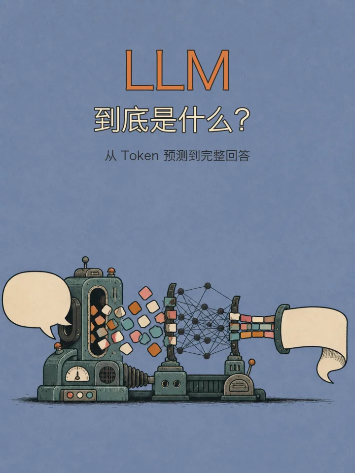
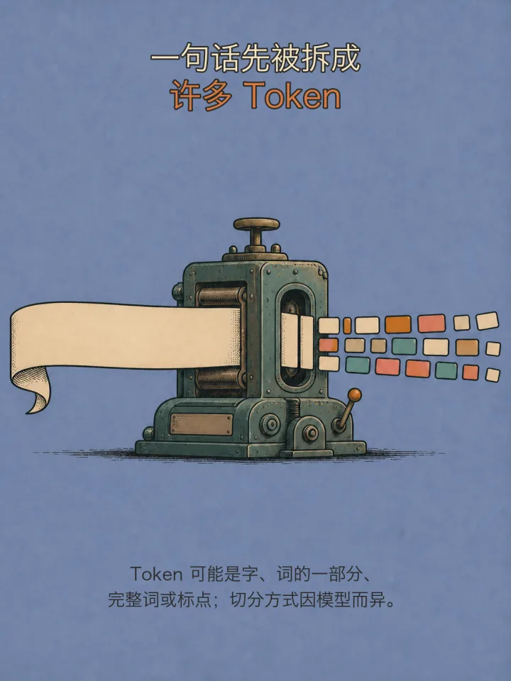
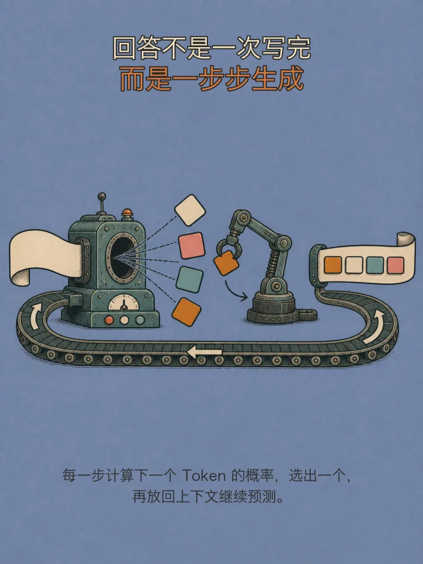
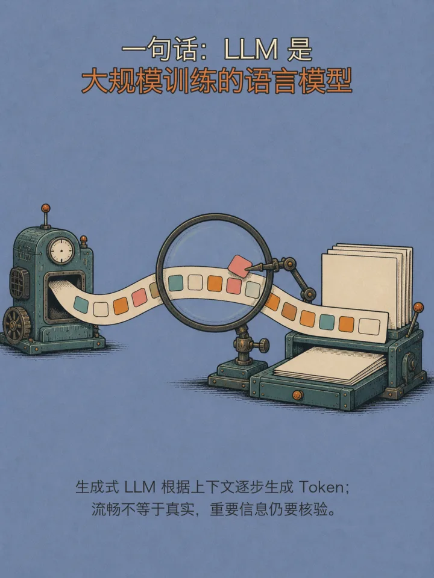
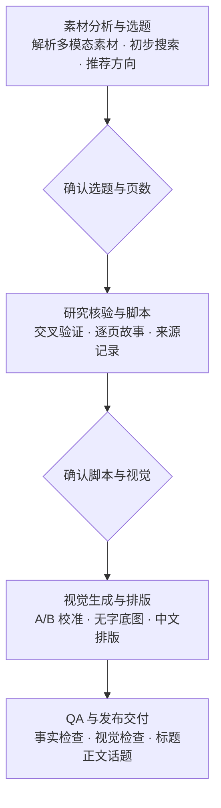

# sfumatoAI Writing Skill

[](LICENSE)
[](ASSET_LICENSE.md)
[](https://github.com/sunshine-lang/sfumatoAI-writing-skill/actions/workflows/validate.yml)

一个面向 AI 小白的小红书知识图文 Skill：把关键词、长文、网页、文件、截图或混合素材，转化为经过资料核验的选题、逐页脚本、统一视觉、多张 3:4 图片和可直接发布的文案。

它不会把用户投喂的内容机械压缩成卡片，而是先判断：**这批素材最值得讲什么？**

## 实际产出示例

下面是一组“LLM 到底是什么？”知识图文中的 4 张成品。点击图片可查看原尺寸预览。

<p align="center">
  <a href="docs/images/examples/llm/page-01-cover.webp"></a>
  <a href="docs/images/examples/llm/page-02-tokenization.webp"></a>
  <br>
  <a href="docs/images/examples/llm/page-04-generation.webp"></a>
  <a href="docs/images/examples/llm/page-06-verification.webp"></a>
</p>

这组图展示的是完整流程中的视觉交付，不只是生成插画：选题与定义先经过核验，再完成故事化拆解、无字底图、确定性中文排版和事实 QA。示例图属于仓库文档，适用 [MIT License](LICENSE)。

## 它解决什么问题

- **选题分析**：从素材池中判断最值得发布的知识点，提供 1 个推荐方向和 2 个备选方向；
- **事实核验**：搜索并交叉验证可靠来源，处理一词多义、营销话术、事实风险和常见误解；
- **图文制作**：规划默认 5–7 张故事化图文，分离无字底图与确定性中文排版，生成标题、正文和话题；
- **质量控制**：检查图片数量与比例、正文长度、重复话题、标题数量和来源数量，并保留人工 QA 关卡。

## 快速开始

### 1. 克隆仓库

```bash
git clone https://github.com/sunshine-lang/sfumatoAI-writing-skill.git
cd sfumatoAI-writing-skill
```

### 2. 安装到 Codex Skills

```bash
mkdir -p ~/.codex/skills
cp -R skills/sfumatoai-writing-skill ~/.codex/skills/
```

如果目标目录已存在，请先备份现有版本，再替换目录。

> 仓库名保留品牌写法 `sfumatoAI-writing-skill`；Codex Skill 的内部标识遵循小写规范，使用 `sfumatoai-writing-skill`。

### 3. 调用 Skill

```text
使用 $sfumatoai-writing-skill 分析我提供的素材，先搜索核验并提出选题和页数方案，确认后制作小红书知识图文。
```

也可以从一个关键词开始：

```text
RAG。我想给对 AI 感兴趣的小白做一组小红书知识图解。
```

或将文章、网页和截图作为素材池：

```text
请分析这篇文章和两张截图，告诉我最值得做成小红书图文的知识点。不要直接开始制图。
```

安装后可用上述 Prompt 进行快速冒烟测试；预期结果应先返回选题方案，而不是直接制图。

## 工作流



Skill 会在关键关卡等待确认，不会拿到素材后直接制图，也不会未经授权自动发布内容。

## 完整交付包含什么

1. 1 个推荐标题与 2 个备选标题；
2. 200 字以内正文；
3. 与内容匹配的话题组合；涉及流量建议时附当前平台采样边界；
4. 至少 4 张严格 3:4 的图片，首张为封面；
5. 逐页内容脚本；
6. 研究底稿与直接来源链接；
7. 图像生成提示词或可复现规格；
8. 自动检查和人工 QA 结论；
9. 已知限制与未采用版本说明。

## 默认视觉方向

- 长春花蓝纯色背景与轻微纸张颗粒；
- 复古编辑漫画与手绘故事感；
- 中等偏粗的炭黑轮廓；
- 低饱和青绿、橙、奶油和淡珊瑚配色；
- 封面大标题居中，主体词加粗放大；
- 内页文字只放顶部、底部或真实对白气泡；
- 不使用四角角标和标题文字底板。

用户提供新的风格参考时，Skill 会先进行 A/B 校准，不会复制参考图中的账号、原文或专属版式。

## 可选品牌人物 IP

仓库收录三张作者本人品牌人物图，用来展示同一人物在正面、行走和侧面状态下的统一方式。它们不是所有使用者都能自动套用的通用素材；第三方运行 Skill 时应提供自己的原创或已授权人物参考。

<p align="center">
  
</p>

<details>
<summary>查看另外两张人物状态图及授权说明</summary>

<p align="center">
  
  
</p>

三张图均为 `1086×1448`、严格 3:4 的 AI 辅助重绘。原始参考图及其中的第三方平台标识没有进入本仓库。图片的肖像、品牌和素材权利不属于 MIT License，具体边界见 [ASSET_LICENSE.md](ASSET_LICENSE.md)。

</details>

## 自动验证

检查仓库结构：

```bash
python3 scripts/check_repository.py
```

检查一组图文交付：

```bash
python3 skills/sfumatoai-writing-skill/scripts/validate_delivery.py /absolute/path/to/manifest.json
```

交付清单模板位于 `skills/sfumatoai-writing-skill/assets/delivery-manifest.template.json`。自动检查不能替代事实审查和视觉检查。

## 仓库结构

<details>
<summary>展开完整目录</summary>

```text
sfumatoAI-writing-skill/
├── README.md
├── LICENSE
├── ASSET_LICENSE.md
├── CONTRIBUTING.md
├── docs/images/examples/llm/
├── scripts/
│   └── check_repository.py
└── skills/
    └── sfumatoai-writing-skill/
        ├── SKILL.md
        ├── agents/openai.yaml
        ├── assets/
        │   ├── delivery-manifest.template.json
        │   └── ip/
        ├── references/
        │   ├── brand-ip.md
        │   ├── content-standards.md
        │   ├── delivery-contract.md
        │   ├── pilot-agent-example.md
        │   ├── visual-system.md
        │   └── xiaohongshu-operations.md
        └── scripts/validate_delivery.py
```

</details>

## 素材与版权

本仓库不分发社交媒体截图、商业字体、原始人物参考图或其他授权不明素材。仓库中的三张品牌人物图由被描绘者本人确认采用，并受 [独立品牌素材条款](ASSET_LICENSE.md) 约束。运行 Skill 时，请只使用你拥有版权、已获授权或许可证允许使用的素材。

本项目与小红书官方无隶属、赞助或背书关系。小红书及相关标识属于其权利人。

## 参与贡献

提交 Issue 或 Pull Request 前，请阅读 [CONTRIBUTING.md](CONTRIBUTING.md)。技术定义和事实修改需要附可靠来源；不要提交无权公开的参考图片、截图或字体。

## License

软件、脚本、模板、文字文档和 `docs/images/examples/` 下的示例图使用 [MIT License](LICENSE) © 2026 sunshine-lang。

三张人物 IP 图片不属于 MIT，适用 [Brand asset terms](ASSET_LICENSE.md)。
